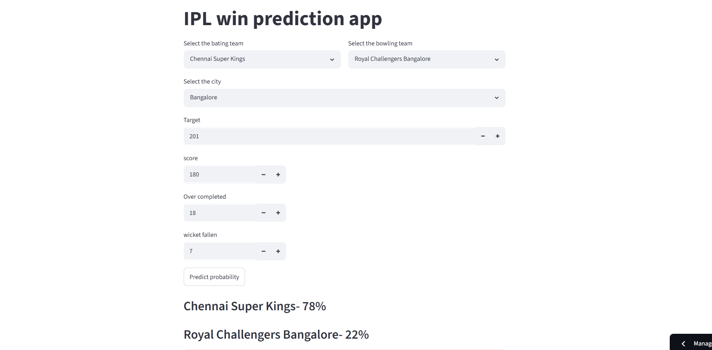

# IPL Win Prediction


##  Project Description

The **IPL Match Winner Prediction** project is a Machine Learning application that predicts the winning probability of an Indian Premier League (IPL) cricket match based on the current match situation. The model uses historical IPL match data and match statistics such as batting team, bowling team, venue, current score, wickets lost, overs completed, and target score to estimate the likelihood of each team winning.

The project demonstrates the complete Machine Learning pipeline, from data preprocessing and model training to deployment as an interactive web application using Streamlit.

## Problem Statement

Predicting the outcome of a cricket match during live gameplay is a challenging task due to multiple influencing factors such as team strength, venue conditions, target score, run rate, and wickets remaining.

The objective of this project is to build a machine learning model capable of estimating the winning probability of a team during an IPL match using historical data and real-time match information.




## Objectives

* Analyze historical IPL match data.
* Perform data preprocessing and feature engineering.
* Train and compare machine learning models for prediction.
* Evaluate model performance using classification metrics.
* Develop an interactive web application for live match winner prediction.
* Deploy the application using Streamlit Cloud.

 
## Project Structure

```

ipl-win-predictor/
│
├── app.py
├── requirements.txt
├── README.md
│
├── data/
│   ├── raw/
│   │   ├── matches.csv
│   │   └── deliveries.csv
│   │
│   └── processed/
│       └── final_df.csv
│
├── notebooks/
│   └── experimentation.ipynb
│
├── src/
│   ├── preprocess.py
│   ├── model_training.py
│   └── helper.py
│
├── models/
│   └── pipe.pkl
│
└── assets/
    └── screenshots/

```


##  Setup Instructions

### 1. Clone the Repository

```bash
git clone https://github.com/jeeva-anand/IPL-Win-Prediction
```

```bash
cd IPL-Match-Winner-Prediction
```

 

### 2. Create a Virtual Environment

### Windows

```bash
python -m venv venv
venv\Scripts\activate
```

### Linux/Mac

```bash
python3 -m venv venv
source venv/bin/activate
```

 

### 3. Install Dependencies

```bash
pip install -r requirements.txt
```

 

### 4. Run the Streamlit Application

```bash
streamlit run app.py
```

The application will open automatically in your browser.

 

##  Project Workflow

1. Importing Necessary Libraries
2. Loading the IPL Dataset
3. Exploratory Data Analysis (EDA)
4. Data Preprocessing
5. Splitting Data into Training and Testing Sets
6. Machine Learning Model Implementation
7. Model Evaluation
8. Building the Streamlit Application
9. Deploying the Application


##  Features Used for Prediction

* Batting Team
* Bowling Team
* Venue
* Target Score
* Current Score
* Overs Completed
* Wickets Lost
* Runs Required
* Balls Remaining
* Current Run Rate (CRR)
* Required Run Rate (RRR)


##  Machine Learning Models

The project can be implemented using models such as:

* Logistic Regression
* Random Forest Classifier
* Decision Tree
* XGBoost
* Gradient Boosting

The best-performing model is saved and used for prediction in the Streamlit application.


##  Usage Example

Enter the following details in the web application:

* Batting Team
* Bowling Team
* Host Stadium
* Target Score
* Current Score
* Overs Completed
* Wickets Lost

Click **Predict Probability** to view the winning chances for both teams.

Example Output:

```
Winning Probability

Batting Team : 72%

Bowling Team : 28%
```


##  Technologies Used

* Python
* Pandas
* NumPy
* Scikit-learn
* Matplotlib
* Streamlit
* Pickle
* Jupyter Notebook


##  Live Demo

Deployed Streamlit URL.

```
https://ipl-win-prediction-2k25.streamlit.app/

```


##  Future Enhancements

* Incorporate player-level statistics and recent form.
* Include weather and pitch conditions.
* Use deep learning models for improved predictions.
* Integrate live IPL score APIs for real-time prediction updates.
* Deploy on cloud platforms with continuous updates.


# If you like this project

Feel free to star ⭐ the repository and contribute improvements!
